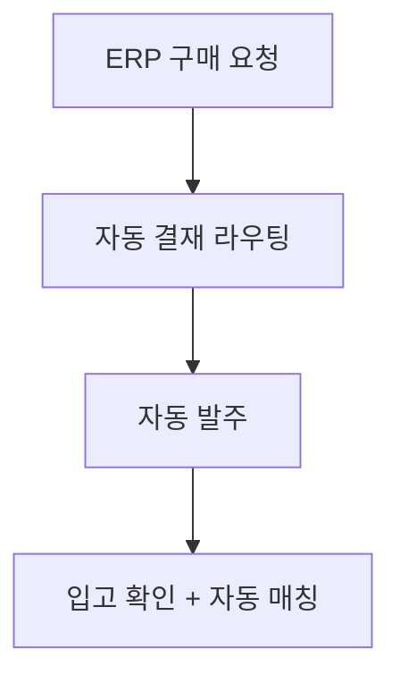
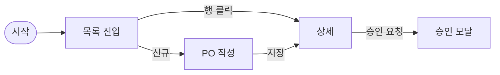
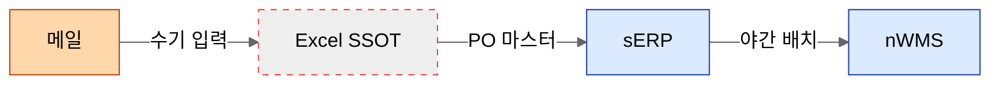
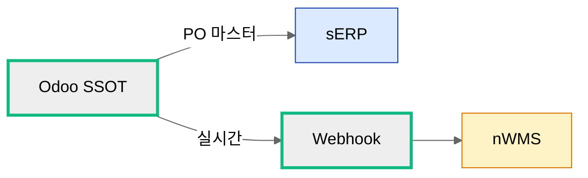
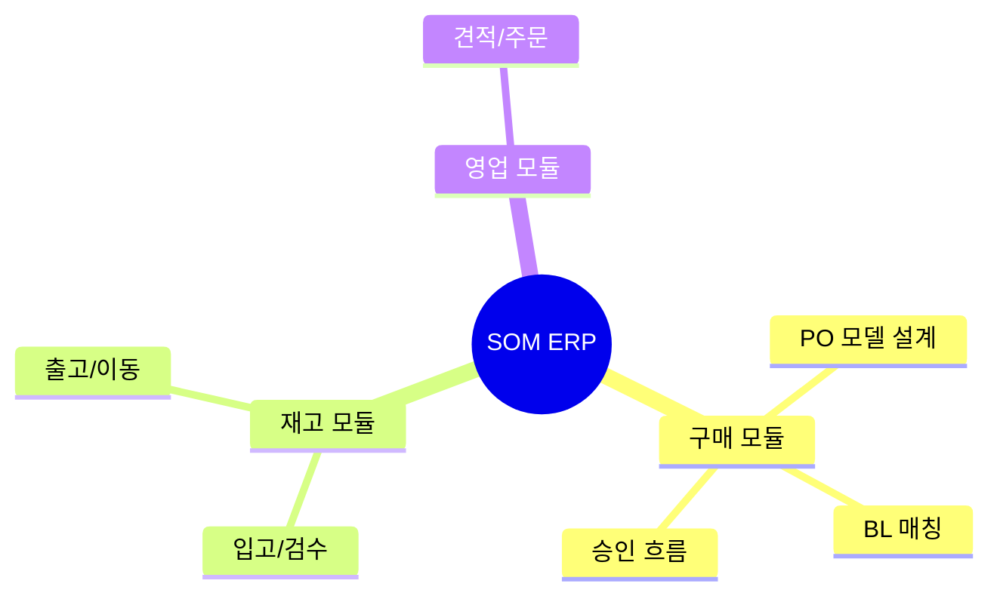
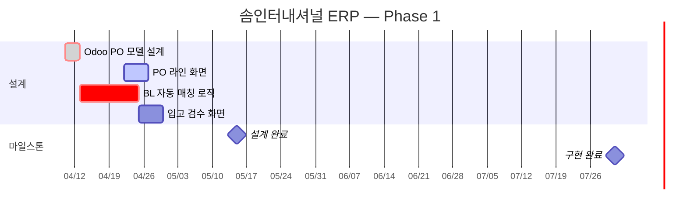

# Phase별 문서 템플릿

각 phase 문서 생성 시 아래 템플릿을 기반으로 작성한다.
frontmatter는 SKILL.md의 스키마를 따르되, phase별 추가 필드를 포함한다.

---

## 00. Organization (ORG)

```markdown
---
id: ORG-001
title: 본사 조직
phase: organizations
project: som-integrated-erp
status: draft
created_at: 2026-04-14
updated_at: 2026-04-14
author: ""
upstream_refs: []
downstream_refs: []
tags:
  - org: headquarters
change_log: []
---

# ORG-001 본사 조직

## 조직 개요

- **조직 유형**: 본사 / 사업부 / 팀
- **상위 조직**: —
- **핵심 역할**: 

## 조직 구조

```
본사
├── 경영지원실
├── 기획팀
└── ...
```

## 밸류체인 / 핵심 프로세스

해당 조직이 담당하는 밸류체인 또는 핵심 업무 프로세스를 기술한다.

## 관련 워크플로우

| 워크플로우 ID | 이름 | 레벨 |
|--------------|------|------|
| WF-001 | Order-to-Cash | lv.1 |

## 변경 이력

| 일자 | 요청 ID | 변경 내용 |
|------|---------|-----------|
| 2026-04-14 | — | 최초 작성 |
```

---

## 01. Workflow (WF)

```markdown
---
id: WF-001
title: Order-to-Cash
phase: workflows
project: som-integrated-erp
status: draft
created_at: 2026-04-14
updated_at: 2026-04-14
author: ""
level: 1
parent_workflow: null
organization: null
upstream_refs: []
downstream_refs:
  - WF-002
tags:
  - org: headquarters
  - workflow: WF-001
change_log: []
---

# WF-001 Order-to-Cash (Lv.1)

## 워크플로우 개요

- **레벨**: 1 (전사 공통)
- **소속 조직**: 전사
- **상위 워크플로우**: —

## 프로세스 흐름


## 단계별 설명

| 단계 | 설명 | 담당 | 시스템 |
|------|------|------|--------|
| 견적 | 고객 견적 요청 처리 | 영업팀 | Odoo |
| ... | ... | ... | ... |

## 하위 워크플로우

| ID | 이름 | 레벨 | 조직 |
|----|------|------|------|
| WF-002 | 영업 프로세스 | lv.2 | 전사 |

## 관련 요구사항

| ID | 제목 |
|----|------|
| REQ-001 | 구매주문 자동화 |

## 변경 이력

| 일자 | 요청 ID | 변경 내용 |
|------|---------|-----------|
| 2026-04-14 | — | 최초 작성 |
```

---

## 10. Requirement — Epic (REQ)

```markdown
---
id: REQ-001
title: 구매주문 자동화
phase: requirements
project: som-integrated-erp
status: draft
created_at: 2026-04-14
updated_at: 2026-04-14
author: ""
type: epic
priority: high
stories:
  - REQ-001-S01
  - REQ-001-S02
upstream_refs: []
downstream_refs:
  - AS-001
tags:
  - org: division-a
  - workflow: WF-001
change_log: []
---

# REQ-001 구매주문 자동화

## 배경 / 목적

왜 이 요구사항이 필요한지, 비즈니스 가치는 무엇인지 기술한다.

## 범위

### 포함

- ...

### 제외

- ...

## 주요 기능 (Stories)

| Story ID | 제목 | 상태 |
|----------|------|------|
| REQ-001-S01 | PO 생성 흐름 | draft |
| REQ-001-S02 | PO 승인 흐름 | draft |

## 이해관계자

| 역할 | 담당자 |
|------|--------|
| 요청자 | |
| 현업 담당 | |
| 개발 담당 | |

## 관련 문서

- 현황 분석: AS-001
- 워크플로우: WF-001

## 변경 이력

| 일자 | 요청 ID | 변경 내용 |
|------|---------|-----------|
| 2026-04-14 | — | 최초 작성 |
```

---

## 10. Requirement — Story (REQ-nnn-Snn)

```markdown
---
id: REQ-001-S01
title: PO 생성 흐름
phase: requirements
project: som-integrated-erp
status: draft
created_at: 2026-04-14
updated_at: 2026-04-14
author: ""
type: story
parent_epic: REQ-001
priority: high
upstream_refs:
  - REQ-001
downstream_refs:
  - AS-001
tags:
  - org: division-a
  - workflow: WF-003
change_log: []
---

# REQ-001-S01 PO 생성 흐름

## 사용자 스토리

**As a** 구매 담당자,
**I want** 구매주문을 시스템에서 직접 생성할 수 있기를,
**So that** 수기 작성으로 인한 오류를 줄이고 처리 속도를 높일 수 있다.

## 인수 조건 (Acceptance Criteria)

1. [ ] 구매 담당자가 품목·수량·단가를 입력하여 PO를 생성할 수 있다
2. [ ] 생성된 PO에 자동으로 PO 번호가 채번된다
3. [ ] ...

## 화면/인터페이스 요약

해당 스토리와 관련된 화면이나 인터페이스 개요를 기술한다.

## 비즈니스 규칙

- 규칙 1: ...
- 규칙 2: ...

## 변경 이력

| 일자 | 요청 ID | 변경 내용 |
|------|---------|-----------|
| 2026-04-14 | — | 최초 작성 |
```

---

## 20. As-Is Analysis (AS)

```markdown
---
id: AS-001
title: 현행 구매주문 프로세스
phase: as_is_analysis
project: som-integrated-erp
status: draft
created_at: 2026-04-14
updated_at: 2026-04-14
author: ""
upstream_refs:
  - REQ-001
  - SYS-001                             # 사용 시스템
  - SYS-004
screens_used:                           # 분석 대상 화면 (21 IA 참조)
  - SYS-001/SCR-PO-001
  - SYS-001/SCR-PO-003
  - SYS-004/sheet-po-master
downstream_refs:
  - TB-001
tags:
  - org: division-a
  - workflow: WF-001
fact_summary:                           # Fact Register 집계
  verified: 0
  in_review: 0
  proposed: 0
  unverified: 0
change_log: []
---

# AS-001 현행 구매주문 프로세스

## 분석 대상

- **관련 요구사항**: REQ-001 구매주문 자동화
- **분석 범위**: 구매 요청 → 발주 → 입고 확인
- **리서치 소스**: (인터뷰, 딥다이브, 시스템 데이터 등 참조한 원본 목록)

## 현행 프로세스

### 프로세스 흐름

```mermaid
flowchart TD
    A[구매 요청서 작성 (수기)] --> B[팀장 결재]
    B --> C[구매팀 발주]
    C --> D[입고 확인]
```

### 단계별 현황

| 단계 | 현행 방식 | 소요 시간 | 담당 | 근거 |
|------|-----------|-----------|------|:----:|
| 구매 요청 | 엑셀 양식 | 1일 `[Q]` | 현업 | 인터뷰 |
| ... | ... | ... | ... | ... |

> 근거 태그: `[Q]` 정성적(인터뷰/관찰), `[F]` 정량적(검증된 사실), `[U]` 미확인

## 시스템 현황

현재 사용 중인 시스템과 그 역할을 기술한다.

## Pain Points / 문제점

각 Pain Point에 근거 유형을 태깅한다.

1. **문제 1** `[Q]`: 설명
   - 영향: 
   - 빈도: 
   - 근거: (인터뷰 일자, 참석자 등)
   - Fact 필요: F-001 (검증이 필요한 수치)

2. **문제 2** `[F]`: 설명
   - 영향: 
   - 빈도: 
   - 근거: (시스템 데이터, 문서 출처)

## 데이터 현황

현행 데이터 구조, 볼륨, 품질 이슈를 기술한다.

## Fact Register

정량적으로 확인해야 할 항목을 추적한다.
AS 문서 작성 시 볼륨/소요시간/오류율/비용/시스템 데이터 영역에서 Fact를 자동 제안한다.

| ID | 항목 | 카테고리 | 현재 값 | 검증 상태 | 소스 | 확인일 |
|----|------|---------|--------|:---------:|------|--------|
| F-001 | 월 평균 PO 건수 | 볼륨 | — | proposed | 인터뷰 추정 | — |
| F-002 | 처리 시간 (건당) | 소요시간 | — | proposed | 인터뷰 추정 | — |
| F-003 | 데이터 불일치율 | 오류율 | — | proposed | — | — |

> 검증 상태: proposed → in_review → verified / unverified / rejected

## 추가 분석 필요 사항

| # | 항목 | 이유 | 우선순위 | 관련 Fact |
|---|------|------|---------|----------|
| 1 | ... | ... | high | F-001 |

## 변경 이력

| 일자 | 요청 ID | 변경 내용 |
|------|---------|-----------|
| 2026-04-14 | — | 최초 작성 |
```

---

## 21. System Landscape — IA (정보 구조 / 메뉴)

각 SYS 폴더 안의 `ia/` 디렉토리에 작성. AS-IS 전용 (TO-BE는 41 _sitemap).

### SYS 본문 frontmatter `ia` 섹션 추가

```yaml
ia:
  menu_tree_levels: 3
  total_menus: 47
  total_screens: 73
  screens_inventoried: 73
  screens_detailed: 12
  roles_count: 5
  as_of: 2026-04-25
  system_version: "sERP 4.5.2"
  lifecycle_stage: live              # planning | partial | live | deprecated
  go_live_progress: 100              # partial일 때만 의미. live=100, deprecated=cutover 진척률
  status_breakdown:                  # 자동 롤업 (screens.md 노드 status 집계)
    live: 73
    in_dev: 0
    planned: 0
    deprecated: 0
```

### lifecycle_stage 결정 가이드

| 시스템 상태 | lifecycle_stage |
|---|---|
| 도입 검토 중, 가동된 영역 0 | `planning` (21에 등록 안 함, 41에만) |
| 일부 영역만 가동, 나머지 개발/계획 | `partial` |
| 모든 영역 안정 가동 | `live` |
| 신 시스템으로 교체 예정 | `deprecated` (21 잔류, cutover 추적) |

### `ia/_overview.md`

```markdown
---
phase: system_landscape
sub_phase: ia
system_id: SYS-001
project: som-integrated-erp
as_of: 2026-04-25
updated_at: 2026-04-25
---

# sERP IA 요약

- **시스템 버전**: 4.5.2 (as_of: 2026-04-25)
- **메뉴 수**: 47 (L1: 5, L2: 28, L3: 14)
- **화면 수**: 73 (인벤토리 100%, SCR 단독 파일 12개)
- **역할 수**: 5 (가시성 매트릭스 verified)
- **주요 모듈**: 영업, 구매, 재고, 회계, 인사
- **사용 부서**: 본사 무역팀, 회계팀, 창고

## 산출물

- [menu-tree.md](./menu-tree.md) — 메뉴 위계
- [screens.md](./screens.md) — 화면 인벤토리
- [role-visibility.md](./role-visibility.md) — 역할별 가시성
- [screens/](./screens/) — 핵심 화면 단독 파일 (12개)

## 다른 phase 참조

| 참조 phase | 문서 | 사용 화면 |
|---|---|---|
| 20.as_is_analysis | AS-001 (수입 PO 분석) | SCR-PO-001, SCR-PO-002, SCR-PO-003 |
| 20.as_is_analysis | AS-002 (인보이스 처리) | SCR-INV-001, SCR-INV-002 |
| 41.ui_design | _sitemap/mapping.md | 전체 매핑 (AS→TO) |
| 50.migration_plans | MIG-001 | SCR-PO-* cutover |
```

### `ia/menu-tree.md`

```markdown
---
phase: system_landscape
sub_phase: ia/menu-tree
system_id: SYS-001
as_of: 2026-04-25
---

# sERP 메뉴 트리

## L1 요약 (시각)

\`\`\`mermaid
graph TD
  Root[sERP 4.5] --> Sales[영업]
  Root --> Purchase[구매]
  Root --> Inventory[재고]
  Root --> Account[회계]
  Root --> HR[인사]
\`\`\`

## L2~L3 상세 (들여쓰기)

- **영업** (M-001)
  - 견적 관리 (M-001-01)
    - 견적서 작성 → SCR-QT-001
    - 견적 목록 → SCR-QT-002
  - 주문 관리 (M-001-02)
    - 주문 입력 → SCR-SO-001
- **구매** (M-002)
  - PO 관리 (M-002-01)
    - PO 생성 → **SCR-PO-001** ★ 핵심 화면
    - PO 승인 → **SCR-PO-002** ★ 핵심 화면
    - PO 목록 → SCR-PO-003
  - 거래처 관리 (M-002-02)
    - 거래처 등록 → SCR-VEN-001
- **재고** (M-003) ...
- **회계** (M-004) ...
- **인사** (M-005) ...

## 변경 이력

| 일자 | 변경 내용 |
|------|----------|
| 2026-04-25 | sERP 4.5.2 기준 최초 작성 |
```

### `ia/menu-tree.mmd` (단독 소스)

본문의 `graph TD` 코드와 **동일 내용**을 별도 파일로 보관 (mmdc 빌드용).

### `ia/screens.md`

```markdown
---
phase: system_landscape
sub_phase: ia/screens
system_id: SYS-001
as_of: 2026-04-25
total: 73
---

# sERP 화면 인벤토리

## 구매 모듈 (M-002)

| ID | 메뉴 경로 | 화면명 | 주요 기능 | 데이터 소스 | 역할 | 상태 | 가동 일자 | 단독 파일 |
|---|---|---|---|---|---|:---:|---|:---:|
| SCR-PO-001 | 구매 > PO > 생성 | 구매주문 입력 | PO 헤더·라인 입력 | tbl_po, tbl_po_line | 구매팀 | 🟢 live | 2026-03-15 | ✓ |
| SCR-PO-002 | 구매 > PO > 승인 | PO 승인 처리 | 결재 라인 진행 | tbl_po, tbl_approval | 팀장+ | 🟡 in_dev | 2026-Q3 | ✓ |
| SCR-PO-003 | 구매 > PO > 목록 | PO 검색·조회 | 필터·엑셀 다운로드 | tbl_po | 구매팀, 회계팀 | ⚪ planned | TBD | — |
| SCR-VEN-001 | 구매 > 거래처 > 등록 | 거래처 등록 | 거래처 마스터 입력 | tbl_vendor | 구매팀 | 🔴 deprecated | (구 시스템) | — |

### 상태 표기

| 표시 | status | 의미 |
|---|---|---|
| 🟢 | `live` | 안정 가동 |
| 🟡 | `in_dev` | 개발 중 (가동 예정 일자 명시 권장) |
| ⚪ | `planned` | 계획만 |
| 🔴 | `deprecated` | 폐기 / 교체 예정 |

## 영업 모듈 (M-001) ...
## 재고 모듈 (M-003) ...
```

### `ia/role-visibility.md`

```markdown
---
phase: system_landscape
sub_phase: ia/role-visibility
system_id: SYS-001
as_of: 2026-04-25
verified: true                          # 관리자가 직접 확인했으면 true
---

# sERP 역할별 메뉴 가시성

R = Read, RW = Read+Write, — = 접근 불가

## 메뉴 수준

| 메뉴 \ 역할 | 사장 | 무역팀장 | 무역사원 | 회계 | 창고 |
|---|:---:|:---:|:---:|:---:|:---:|
| 영업 > 견적 | R | RW | RW | R | — |
| 영업 > 주문 | R | RW | RW | R | — |
| 구매 > PO 생성 | R | RW | RW | — | — |
| 구매 > PO 승인 | RW | RW | — | — | — |
| 회계 > 분개 | RW | — | — | RW | — |

## 화면 수준 (예외만)

| 화면 \ 역할 | 사장 | 무역팀장 | 무역사원 | 회계 | 창고 |
|---|:---:|:---:|:---:|:---:|:---:|
| SCR-PO-002 (PO 승인) | RW | RW | — | — | — |

## 검증 노트

- 2026-04-25 무역팀장 인터뷰로 확인 (verified)
- 사장 권한은 admin 계정 화면 캡처로 확인 (verified)
- 회계팀 일부 메뉴는 unverified — 추가 인터뷰 필요
```

### `ia/screens/SCR-PO-001_po-create.md` (핵심 화면 단독 파일, 옵션)

```markdown
---
id: SYS-001/SCR-PO-001
title: 구매주문 입력
phase: system_landscape
sub_phase: ia/screens
system_id: SYS-001
menu_path: 구매 > PO 관리 > PO 생성
roles: [무역팀장, 무역사원]
as_of: 2026-04-25
---

# SCR-PO-001 구매주문 입력

## 화면 캡처


## 주요 입력 필드

| 필드 | 타입 | 필수 | 비고 |
|---|---|:---:|---|
| PO 번호 | text | auto | 자동 채번 |
| 거래처 | select | ✓ | tbl_vendor 참조 |
| 발주일 | date | ✓ | 기본값: 오늘 |
| 라인 (반복) | composite | ✓ | 품목·수량·단가·금액 |

## 검증 규칙 (관찰)

- 거래처 미선택 시 저장 불가
- 라인 0건이면 저장 불가
- 금액 0원 허용 (이상치 — 인터뷰 필요)

## 사용 빈도

- 무역팀 일평균 5~7건 (Fact: F-002 proposed)
```

### Excel SSOT의 `ia/sheet-tree.md` (시스템이 엑셀일 때)

```markdown
# Excel SSOT — 시트 트리

- **PO/BL 마스터** (po-bl-master.xlsx)
  - 시트: `PO_Master` → sheet-po-master
  - 시트: `BL_Master` → sheet-bl-master
  - 시트: `거래처_lookup` → sheet-vendor-lookup
- **선적 일정** (shipping-schedule.xlsx)
  - 시트: `2026Q1` → sheet-2026q1
  - 시트: `2026Q2` → sheet-2026q2
```

---

## 30. To-Be Direction (TB)

```markdown
---
id: TB-001
title: 구매주문 프로세스 개선 방향
phase: to_be_directions
project: som-integrated-erp
status: draft
created_at: 2026-04-14
updated_at: 2026-04-14
author: ""
upstream_refs:
  - AS-001
downstream_refs:
  - IMP-001
  - MIG-001
tags:
  - org: division-a
  - workflow: WF-001
change_log: []
---

# TB-001 구매주문 프로세스 개선 방향

## 개선 배경

- **현황 참조**: AS-001
- **핵심 문제**: (AS 문서의 Pain Points 요약)

## 개선 방향

### 방향 1: 구매주문 디지털화

- **현행**: 엑셀 수기 작성
- **개선**: ERP 시스템 내 온라인 PO 생성
- **기대 효과**: 처리 시간 50% 단축, 오류율 감소

### 방향 2: ...

## To-Be 프로세스



## 우선순위

| 개선 항목 | 영향도 | 난이도 | 우선순위 |
|-----------|--------|--------|---------|
| PO 디지털화 | 높음 | 중간 | 1 |
| ... | ... | ... | ... |

## 제약 조건 / 리스크

- 제약 1: ...
- 리스크 1: ...

## 변경 이력

| 일자 | 요청 ID | 변경 내용 |
|------|---------|-----------|
| 2026-04-14 | — | 최초 작성 |
```

---

## 40. Implementation Plan (IMP)

```markdown
---
id: IMP-001
title: 구매주문 시스템 구현 계획
phase: implementation_plans
project: som-integrated-erp
status: draft
created_at: 2026-04-14
updated_at: 2026-04-14
author: ""
upstream_refs:
  - TB-001
downstream_refs:
  - UG-001
tags:
  - org: division-a
  - workflow: WF-001
change_log: []
---

# IMP-001 구매주문 시스템 구현 계획

## 개요

- **개선 방향 참조**: TB-001
- **구현 범위**: 

## 기술 설계 요약

### 아키텍처

관련 모듈, 레이어, 데이터 흐름을 기술한다.

### DB 변경

| 테이블 | 변경 유형 | 설명 |
|--------|-----------|------|
| som.purchase_orders | 신규 | 구매주문 테이블 |
| ... | ... | ... |

### API 설계

| 엔드포인트 | 메서드 | 설명 |
|-----------|--------|------|
| /api/purchase-orders | POST | PO 생성 |
| ... | ... | ... |

### 화면 설계

| 화면 | 경로 | 설명 |
|------|------|------|
| PO 목록 | /purchase/orders | 구매주문 목록 |
| ... | ... | ... |

## 구현 단계

| 단계 | 내용 | 산출물 |
|------|------|--------|
| 1 | DB 스키마 + 마이그레이션 | SQL, Prisma 스키마 |
| 2 | 백엔드 API | Service, Repository |
| 3 | 프론트엔드 | 페이지, 컴포넌트 |
| 4 | 테스트 | 단위/통합/E2E |

## 변경 이력

| 일자 | 요청 ID | 변경 내용 |
|------|---------|-----------|
| 2026-04-14 | — | 최초 작성 |
```

---

## 41. UI Design (UX)

```markdown
---
id: UX-001
title: 구매주문 화면 설계
phase: ui_design
project: som-integrated-erp
status: draft
created_at: 2026-04-18
updated_at: 2026-04-18
author: ""
upstream_refs:
  - IMP-001
downstream_refs:
  - UG-001
  - UAT-001
tags:
  - org: division-a
  - workflow: WF-001
screens_total: 5
screens_as_is_html: 0
screens_to_be_html: 0
has_as_is: true
change_log: []
---

# UX-001 구매주문 화면 설계

## 대상 기능

- **관련 IMP**: IMP-001 구매주문 시스템
- **관련 UG**: UG-001 (하류)
- **디바이스**: 데스크탑 / 모바일 (해당 시)

## 정보 구조 (IA)

해당 기능의 페이지 계층을 Mermaid 트리로 표현한다.

```mermaid
flowchart TD
    ROOT[/purchase] --> LIST[/purchase/orders]
    LIST --> NEW[/purchase/orders/new]
    LIST --> DETAIL[/purchase/orders/:id]
    DETAIL --> APPROVE[/purchase/orders/:id/approve]
```

## 화면 목록

| ID | 화면명 | 경로 | 디바이스 | AS-IS | TO-BE | 우선순위 |
|----|-------|------|---------|:-----:|:-----:|:--------:|
| S01 | PO 목록 | `/purchase/orders` | 데스크탑 | ✅ | ✅ | P0 |
| S02 | PO 상세 | `/purchase/orders/:id` | 데스크탑 | ✅ | ✅ | P0 |
| S03 | PO 신규 | `/purchase/orders/new` | 데스크탑 | — | ✅ | P0 |
| S04 | PO 승인 | 모달 | 데스크탑 | — | ✅ | P1 |

> ✅: HTML 작성 완료 · —: 해당 없음/신규 · ⏳: 작성 예정

## 화면 플로우

사용자 여정 기반 화면 이동.



## 주요 화면 상세

### S01. PO 목록

- **AS-IS**: [as-is/list.html](./as-is/list.html)
- **TO-BE**: [to-be/list.html](./to-be/list.html)
- **주요 변경점**:
  - 수기 입력 → 시스템 생성 PO로 대체
  - 필터에 거래처·상태 추가
  - 승인 대기 건 뱃지 표시
- **인터랙션**: 행 클릭 → 상세 이동, 체크박스 → 일괄 승인

### S02. PO 상세
...

## UI 패턴 / 컴포넌트

- **shell**: `_shared/shell-desktop.html` 기반
- **테이블**: shadcn `DataTable` 대응
- **모달**: shadcn `Dialog` 대응
- 재사용 컴포넌트 목록

## 접근성 / 반응형

- 키보드 네비 지원: Tab/Enter
- 최소 지원 해상도: 1280 (데스크탑), 360 (모바일)
- 컬러 대비: WCAG AA

## 변경 이력

| 일자 | 요청 ID | 변경 내용 |
|------|---------|-----------|
| 2026-04-18 | — | 최초 작성 |
```

### HTML 프로토타입 규약

**⚠ 전 UX 문서 공통 필독**. `_shared/README.md`에도 복사되어 있음.

| 규칙 | 내용 |
|------|------|
| 기술 | 바닐라 HTML + **Tailwind CDN** (`<script src="https://cdn.tailwindcss.com"></script>`) + 바닐라 JS (인라인) |
| 실행 | 서버 없이 **`file://` 로 열람 가능**. `index.html` 더블클릭으로 시작 |
| 공통 shell | `_shared/shell-desktop.html` / `shell-mobile.html` 복사해서 시작 |
| **변종 배너** | 모든 페이지 상단에 필수 — AS-IS는 빨간색, TO-BE는 파란색 (아래 코드 블록 참고) |
| 페이지 간 이동 | 상대 경로 `<a href="./xxx.html">` 만 사용 (외부 URL은 `#` 스텁) |
| 데이터 | **하드코딩**. DB/API 호출 금지 |
| 디바이스 분리 | 데스크탑/모바일 레이아웃이 크게 다르면 `-desktop.html`, `-mobile.html`로 파일 분리 |
| 크기 제한 | 각 HTML **300줄 이내**. 초과 시 분할 |
| 외부 리소스 | Tailwind CDN만 허용. 폰트·아이콘은 SVG inline 또는 이모지 |
| drift 허용 | HTML은 **approved 시점 스냅샷**. 이후 구현 drift 발생 시 UX 문서 재승인으로 정정 |

#### 변종 배너 필수 코드

**AS-IS 페이지 상단**:
```html
<div class="bg-red-50 border-b border-red-200 text-red-700 text-xs text-center py-1 font-medium">
  AS-IS PROTOTYPE — 현행 UI 스냅샷 (개선 전)
</div>
```

**TO-BE 페이지 상단**:
```html
<div class="bg-blue-50 border-b border-blue-200 text-blue-700 text-xs text-center py-1 font-medium">
  TO-BE PROTOTYPE — 개선 UI 프로토타입 (설계안)
</div>
```

#### 페이지 골격 예시

```html
<!DOCTYPE html>
<html lang="ko">
<head>
  <meta charset="UTF-8">
  <title>[TO-BE] PO 목록</title>
  <script src="https://cdn.tailwindcss.com"></script>
  <link rel="stylesheet" href="../../_shared/tokens.css">
</head>
<body class="bg-gray-50">
  <!-- 변종 배너 -->
  <div class="bg-blue-50 border-b border-blue-200 text-blue-700 text-xs text-center py-1">
    TO-BE PROTOTYPE
  </div>

  <!-- Header (shell-desktop.html 참고) -->
  <header class="bg-white border-b px-6 h-14 flex items-center">
    <h1 class="font-semibold text-lg">구매주문</h1>
  </header>

  <!-- Main -->
  <main class="p-6">
    <!-- 실제 화면 내용 -->
  </main>
</body>
</html>
```

#### NO_AS_IS.md 샘플 (신규 개발이라 AS-IS가 없을 때)

```markdown
# NO_AS_IS

해당 기능은 **신규 개발**로 AS-IS UI가 존재하지 않음.

- 관련 REQ: REQ-010 (진척률 0%)
- 대체 근거: 유사 도메인의 타 시스템 레퍼런스 (필요 시 기재)
```

---

## 42. Flowchart — Data (FCD) / 43. Flowchart — Workflow (FCW)

> **양 phase는 동일한 템플릿 구조**를 사용한다. ID 접두사(`FCD` vs `FCW`), 계층 정의(시스템 vs 밸류체인 등)만 다르다.

### 본문 템플릿 (`FCD-Lx-001_<주제>.md`)

```markdown
---
id: FCD-L1-001
title: 시스템 랜드스케이프 — PO/입고 데이터 흐름
phase: flowchart_data            # flowchart_workflow면 phase 변경
project: som-integrated-erp
status: draft
level: L1                        # L1 | L2 | L3
parent_chart: null               # L2/L3는 상위 다이어그램 ID
created_at: 2026-04-25
updated_at: 2026-04-25
author: ""
upstream_refs:
  - SYS-001                      # FCD: system_landscape, IMP
  - IMP-001                      # FCW: workflows, REQ, TB
downstream_refs:
  - FCD-L2-001                   # 하위 레벨 다이어그램
  - UG-001
tags:
  - org: division-a
  - workflow: WF-001
nodes_count_as_is: 7
nodes_count_to_be: 8
has_as_is: true
diff_summary:
  added: 3
  removed: 2
  modified: 1
  kept: 4
change_log: []
---

# {제목}

## 다이어그램 의도

- **독자**: (개발자 / 현업 / PM)
- **질문 답하기**: 이 다이어그램이 답하는 핵심 질문 1~2개
- **드릴다운**: 하위 레벨로 내려가는 박스 명시

## AS-IS



## TO-BE



## Diff 요약

상세 노드별 변경은 `diff.md` 참조.

- 🟢 추가 3 / 🔴 제거 2 / 🟡 변경 1 / ⚪ 유지 4
- 핵심 변화: SSOT 단일화 (Excel→Odoo), 실시간 동기 (배치→Webhook)

## 드릴다운

- L2-001: [구매 데이터 흐름](../FCD-L2-001_procurement-data/FCD-L2-001_procurement-data.md)
- L2-002: [재고 데이터 흐름](../FCD-L2-002_inventory-data/FCD-L2-002_inventory-data.md)

## 변경 이력

| 일자 | 요청 ID | 변경 내용 |
|------|---------|-----------|
| 2026-04-25 | — | 최초 작성 |
```

### `as-is.mmd` / `to-be.mmd` (단독 소스, mmdc 빌드용)

본문에 임베드된 mermaid 코드와 **동일 내용**을 별도 파일로 보관한다 (mmdc로 SVG/PNG 빌드 시 입력).

```
%%{init: {'theme':'neutral'}}%%
graph LR
  ... (본문 mermaid 코드와 동일)
```

### `diff.md` 템플릿

```markdown
# Diff: FCD-L1-001 System Landscape

## 요약

| 추가 | 제거 | 변경 | 유지 | 합계 |
|:---:|:---:|:---:|:---:|:---:|
| 🟢 3 | 🔴 2 | 🟡 1 | ⚪ 4 | 10 |

## 노드별 상세

### 🟢 추가
- `Odoo`: SSOT 마스터로 도입
- `Webhook`: nWMS 실시간 동기화 채널
- `OdooAPI`: 외부 시스템 진입점

### 🔴 제거
- `Excel SSOT`: PO/BL 마스터 폐기 (Odoo로 흡수)
- `수기 메일 입력`: 자동화로 대체

### 🟡 변경
- `nWMS`: 마스터(독립) → 서브(Odoo가 마스터)

### ⚪ 유지
- `sERP`, `Email (알림용)`, `BL 양식`, `검수 절차`

## 핵심 변화 의의

1. **SSOT 단일화**: 엑셀 → DB. 정합성·연속성 개선
2. **실시간 동기화**: 야간 배치 → Webhook. 재고 정확도 +
3. **책임 이관**: 수동 입력 → 시스템 자동. 인적 오류 감소

## 영향 받는 하류 문서

- IMP-003 (Odoo 도입 설계)
- MIG-001 (Excel → Odoo 데이터 이관)
- UG-002 (변경된 PO 화면 가이드)
```

### `_shared/classes.mmd` (공통 classDef)

```
%% 공통 classDef — 모든 다이어그램이 이 정의를 import 또는 동일 코드 사용
%% Mermaid 자체 import 미지원 → 각 다이어그램에 동일 코드 복사 또는 본문 README에 명시

classDef system fill:#dbeafe,stroke:#1e40af,color:#1e3a8a
classDef actor fill:#fed7aa,stroke:#c2410c,color:#7c2d12
classDef data fill:#dcfce7,stroke:#166534,color:#14532d
classDef process fill:#f3f4f6,stroke:#374151,color:#111827

%% 변경 표시 (AS-IS → TO-BE diff)
classDef added stroke:#10b981,stroke-width:3px
classDef removed stroke:#ef4444,stroke-dasharray:5 5
classDef modified fill:#fef3c7,stroke:#d97706,stroke-width:2px
classDef kept fill:#f3f4f6
```

### `_shared/legend.md` (범례)

```markdown
# 다이어그램 범례

## 색상·도형 (의미 기반)

| 클래스 | 색상 | 용도 |
|---|---|---|
| `system` | 🔵 파란 fill | 시스템·플랫폼 |
| `actor` | 🟠 주황 fill | 사람·역할·외부 액터 |
| `data` | 🟢 초록 fill | 데이터 객체·테이블·문서 |
| `process` | ⚪ 회색 fill | 처리·계산·변환 단계 |

## 변경 표시 (AS-IS → TO-BE)

| 클래스 | 표시 | 의미 |
|---|---|---|
| `added` | 🟢 초록 굵은 stroke | 새로 추가됨 |
| `removed` | 🔴 빨간 점선 stroke | 제거됨 |
| `modified` | 🟡 노란 fill + 굵은 stroke | 역할/책임 변경 |
| `kept` | ⚪ 회색 fill | 유지 (참고용) |

## 방향 규칙

- 데이터 흐름: 좌→우 (`graph LR`) 권장
- 워크플로우: 위→아래 (`graph TD`) 권장
- 한 다이어그램 안에서 방향 혼용 금지

## 노드 수 제한

- L1: 최대 7~9 노드
- L2: 최대 9~12 노드
- L3: 무제한 (단, 단일 주제·일관 추상도 유지)
- 초과 시: 하위 레벨로 분할
```

---

## 41. UI Design — `_sitemap/mapping.md` (AS↔TO 화면 매핑 + Cutover 진척 대시보드)

`41.ui_design/_sitemap/mapping.md`. AS-IS 화면(21)이 TO-BE로 어떻게 변하고, **현재 cutover 진척이 어디까지 왔는지** 추적하는 살아있는 표. 50 마이그레이션의 진척률 단일 출처.

```markdown
---
phase: ui_design
sub_phase: _sitemap/mapping
project: som-integrated-erp
as_of: 2026-04-25
upstream_refs:
  - SYS-001                        # 21 IA (deprecated 대상)
  - SYS-004
  - SYS-008                        # 21 IA (partial — 가동 영역)
downstream_refs:
  - MIG-001                        # 50 cutover 계획
  - WBS-001                        # 80 work item 연결
cutover_progress:                  # 자동 롤업
  total: 73
  completed: 25
  in_progress: 18
  not_started: 30
  retired: 0
  percent: 34
---

# AS-IS → TO-BE 화면 매핑 + Cutover 진척

## 매핑 + 진척 표

| AS-IS (21) | 변화 | TO-BE | 현재 상태 | 가동 일자 | MIG | WBS |
|---|:---:|---|:---:|---|:---:|:---:|
| SYS-001/SCR-PO-001 (구매주문) | ▶ 통합 | SYS-008/SCR-PO-001 | 🟢 cutover 완료 | 2026-03-15 | MIG-001-T01 | WBS-001-T01 |
| SYS-001/SCR-PO-002 (PO 승인) | ✗ 폐기 | — | 🟢 폐기 완료 | 2026-03-15 | — | — |
| SYS-001/SCR-PO-003 (PO 목록) | → 1:1 | SYS-008/SCR-PO-003 | 🟡 진행 중 | 2026-Q3 예정 | MIG-001-T02 | WBS-001-T05 |
| SYS-004/sheet-po-master | ▶ 통합 | SYS-008/SCR-PO-003 | 🟡 진행 중 | 2026-Q3 예정 | MIG-001-T02 | WBS-001-T05 |
| SYS-004/sheet-bl-master | ▶ 통합 | UX-002/bl-list.html | ⚪ 미시작 | TBD | MIG-001-T03 | — |

> **TO-BE 컬럼**:
> - 가동 후엔 *21의 화면 ID* 사용 (SYS-008/SCR-* — partial→live 전이 반영)
> - 미가동은 41의 UX-* 또는 HTML 파일 ID
> - 가동 시점에 컬럼 값 갱신 (41 → 21)

## 변화 카테고리

- **→ 1:1**: 1:1 대응
- **▶ 통합 (N:1)**: 여러 AS-IS → 1 TO-BE
- **▶ 분리 (1:N)**: 1 AS-IS → 여러 TO-BE
- **+ 신규**: AS-IS 없음, TO-BE 신설
- **✗ 폐기**: TO-BE 제거 (자동화 등)

## 현재 상태 카테고리

| 표시 | 상태 | 의미 |
|---|---|---|
| 🟢 cutover 완료 | TO-BE 화면이 가동, AS-IS 사용 중단 |
| 🟢 폐기 완료 | AS-IS 사용 중단 (대체 TO-BE 없음) |
| 🟡 진행 중 | TO-BE 개발 중 또는 부분 사용 |
| ⚪ 미시작 | 계획만, 작업 시작 안 함 |

## Cutover 진척 (자동 롤업)

- 총 AS-IS 화면: **73**
- 🟢 완료: **25** (34%) — cutover 19, 폐기 6
- 🟡 진행 중: **18**
- ⚪ 미시작: **30**

\`\`\`
████████░░░░░░░░░░░░░░ 34%
\`\`\`

## 통계 (변화 카테고리별)

- 1:1: 38 / 통합 (N:1): 22 / 분리 (1:N): 3 / 폐기: 10
- 신규 TO-BE 화면: 12 (AS-IS 없음, mapping에 별도 행으로 추가)

## 변경 이력

| 일자 | 변경 내용 |
|------|----------|
| 2026-04-25 | SCR-PO-001 cutover 완료 — TO-BE 컬럼을 41 UX → 21 SYS-008/SCR-PO-001로 갱신 |
| 2026-03-15 | SCR-PO-001, SCR-PO-002 cutover 첫 차수 |
| 2026-04-01 | 최초 매핑 작성 |
```

---

## 50. Migration Plan (MIG)

```markdown
---
id: MIG-001
title: 구매 데이터 마이그레이션 계획
phase: migration_plans
project: som-integrated-erp
status: draft
created_at: 2026-04-14
updated_at: 2026-04-14
author: ""
upstream_refs:
  - TB-001
  - IMP-001
downstream_refs: []
tags:
  - org: division-a
change_log: []
---

# MIG-001 구매 데이터 마이그레이션 계획

## 개요

- **구현 계획 참조**: IMP-001
- **마이그레이션 범위**: 

## 소스 → 타겟 매핑

| 소스 (현행) | 타겟 (신규) | 변환 규칙 |
|------------|-----------|-----------|
| Excel.구매요청 | som.purchase_orders | ... |
| ... | ... | ... |

## 데이터 볼륨

| 대상 | 건수 (추정) | 비고 |
|------|------------|------|
| 구매주문 | 10,000 | 최근 3년분 |

## 마이그레이션 절차

1. 데이터 추출 (소스)
2. 변환/정제
3. 검증 (샘플)
4. 적재 (타겟)
5. 검증 (전수)
6. 전환 완료 선언

## 롤백 계획

마이그레이션 실패 시 복구 절차를 기술한다.

## 변경 이력

| 일자 | 요청 ID | 변경 내용 |
|------|---------|-----------|
| 2026-04-14 | — | 최초 작성 |
```

---

## 60. User Guide (UG)

```markdown
---
id: UG-001
title: 구매주문 사용자 가이드
phase: user_guide
project: som-integrated-erp
status: draft
created_at: 2026-04-14
updated_at: 2026-04-14
author: ""
upstream_refs:
  - IMP-001
downstream_refs:
  - UAT-001
tags:
  - org: division-a
change_log: []
---

# UG-001 구매주문 사용자 가이드

## 대상 사용자

- **역할**: 구매 담당자
- **전제 조건**: ERP 로그인 권한, 구매 메뉴 접근 권한

## 기능 개요

이 가이드에서 다루는 기능의 목적과 범위를 간단히 설명한다.

## 사용 방법

### 1. 구매주문 생성

1. 메뉴: 구매 > 구매주문 > 신규
2. 필수 입력 항목:
   - 거래처: ...
   - 품목: ...
3. [저장] 클릭

### 2. 구매주문 승인

1. ...

## 주의사항

- 주의 1: ...

## FAQ

| 질문 | 답변 |
|------|------|
| Q1 | A1 |

## 변경 이력

| 일자 | 요청 ID | 변경 내용 |
|------|---------|-----------|
| 2026-04-14 | — | 최초 작성 |
```

---

## 70. User Acceptance Log (UAT)

```markdown
---
id: UAT-001
title: 구매주문 인수 테스트
phase: user_acceptance_log
project: som-integrated-erp
status: draft
created_at: 2026-04-14
updated_at: 2026-04-14
author: ""
test_result: null
tested_by: ""
tested_at: null
guide_ref: UG-001
upstream_refs:
  - UG-001
downstream_refs: []
tags:
  - org: division-a
change_log: []
---

# UAT-001 구매주문 인수 테스트

## 테스트 개요

- **대상 가이드**: UG-001 구매주문 사용자 가이드
- **테스터**: 
- **테스트 일자**: 
- **결과**: (pass / fail / partial)

## 테스트 시나리오

| # | 시나리오 | 기대 결과 | 실제 결과 | 판정 |
|---|---------|-----------|-----------|------|
| 1 | PO 생성 후 저장 | PO 번호 자동 채번 | | |
| 2 | 필수 항목 미입력 시 저장 | 유효성 검증 에러 | | |
| 3 | ... | ... | | |

## 발견된 이슈

| # | 이슈 | 심각도 | 상태 |
|---|------|--------|------|
| 1 | | high/medium/low | open/resolved |

## 테스터 의견

자유 형식으로 피드백을 기록한다.

## 최종 판정

- [ ] PASS — 인수 조건 충족
- [ ] FAIL — 재작업 필요
- [ ] PARTIAL — 조건부 인수 (이슈 목록 참고)

## 변경 이력

| 일자 | 요청 ID | 변경 내용 |
|------|---------|-----------|
| 2026-04-14 | — | 최초 작성 |
```

---

## 80. Project Management — WBS (작업 분해)

### 본문 템플릿 (`WBS-001_overall.md`)

```markdown
---
id: WBS-001
title: 솜인터내셔널 ERP — 전체 작업 분해
phase: project_management
project: som-integrated-erp
status: draft
as_of: 2026-04-25
baseline_locked_at: 2026-04-25
level: L1
parent_wbs: null
created_at: 2026-04-25
updated_at: 2026-04-25
author: ""
upstream_refs:
  - REQ-001
  - REQ-002
  - IMP-001
downstream_refs:
  - TL-001
work_items:
  - id: WBS-001-T01
    title: Odoo PO 모델 설계
    refs: [REQ-001-S01, IMP-001]
    owner: "@hongjoo"
    estimate: 3d
    actual: 3.5d
    status: done
    started_at: 2026-04-10
    completed_at: 2026-04-13
    blocked_reason: null
  - id: WBS-001-T02
    title: PO 라인 화면 구현
    refs: [UX-001]
    owner: "@daniel"
    estimate: 5d
    actual: null
    status: doing
    started_at: 2026-04-22
    completed_at: null
    blocked_reason: null
progress:
  total: 32
  done: 12
  doing: 5
  todo: 14
  blocked: 1
  percent: 38
change_log: []
---

# {제목}

## 트리



> 노드 수가 많으면 `graph TD`로 폴백. status별 색상은 `_shared/classes.mmd` 참조.

## Work Items

| ID | 제목 | refs | 담당 | 추정 | 실제 | 상태 |
|---|---|---|---|:---:|:---:|:---:|
| T01 | Odoo PO 모델 설계 | REQ-001-S01, IMP-001 | @hongjoo | 3d | 3.5d | 🟢 done |
| T02 | PO 라인 화면 구현 | UX-001 | @daniel | 5d | — | 🟡 doing |
| T03 | BL 자동 매칭 로직 | REQ-001-S02 | TBD | 8d | — | ⚪ todo |
| T04 | 입고 검수 화면 | UX-002 | TBD | 5d | — | 🔴 blocked |

## 진척 요약

- 전체 32개 work item 중 done 12 / doing 5 / todo 14 / blocked 1
- 진척률 **38%**
- blocked 1건: T04 입고 검수 화면 — 상위 의존성 (Odoo 입고 모델) 대기

## 추적성

- 상류: REQ-001 (구매주문 자동화), REQ-002 (재고 추적), IMP-001 (Odoo 도입 설계)
- 하류: TL-001 (전체 일정 — 이 WBS 기반)

## 변경 이력

| 일자 | 요청 ID | 변경 내용 |
|------|---------|-----------|
| 2026-04-25 | — | baseline 잠금 (snapshots/2026-04-25_baseline.md) |
| 2026-04-25 | — | 최초 작성 |
```

### `tree.mmd` (단독 소스, mmdc 빌드용)

본문 mindmap 코드와 **동일 내용**을 별도 파일로 보관.

```
mindmap
  root((SOM ERP))
    구매 모듈
      ...
```

### `snapshots/<date>_baseline.md` (baseline 잠금)

baseline 잠금 시점에 본문 전체를 복사하여 보관. 이후 변경은 본문에서만, snapshot은 불변.

---

## 80. Project Management — Timeline (타임라인)

### 본문 템플릿 (`TL-001_overall.md`)

```markdown
---
id: TL-001
title: 솜인터내셔널 ERP — 전체 일정
phase: project_management
project: som-integrated-erp
status: draft
as_of: 2026-04-25
baseline_locked_at: 2026-04-25
level: L1
wbs_ref: WBS-001
date_range:
  start: 2026-04-01
  end: 2026-09-30
created_at: 2026-04-25
updated_at: 2026-04-25
author: ""
upstream_refs:
  - WBS-001
downstream_refs: []
milestones:
  - id: MS-001
    title: 설계 완료
    target_date: 2026-05-15
    actual_date: null
    epic_refs: [REQ-001, REQ-002]
    status: on_track
    note: ""
  - id: MS-002
    title: 구현 완료
    target_date: 2026-07-31
    actual_date: null
    epic_refs: [REQ-001, REQ-002, REQ-003]
    status: at_risk
    note: "T03 BL 매칭 로직 8d 예상이 12d로 증가"
critical_path: [WBS-001-T01, WBS-001-T03, WBS-001-T08, WBS-001-T15]
change_log: []
---

# {제목}

## Gantt



> `crit` = 임계 경로 (사람이 마킹). `done`/`active`/(미지정=todo) 자동 색상.

## 마일스톤

| ID | 제목 | 목표일 | 실제 도달일 | 상태 | Epic | 비고 |
|---|---|---|---|:---:|---|---|
| MS-001 | 설계 완료 | 2026-05-15 | — | 🟡 on_track | REQ-001, 002 | — |
| MS-002 | 구현 완료 | 2026-07-31 | — | 🔴 at_risk | REQ-001, 002, 003 | T03 12d로 증가 |

## 임계 경로

WBS-001-T01 → T03 → T08 → T15

> 사람이 검토·합의 후 마킹. 의존성·기간 변경 시 재산정.

## 진척 요약 (WBS-001에서 가져옴)

- 진척률 38% (12/32)
- 임계 경로 위 작업 중 done 1, doing 0, todo 3
- 위험: T03 (BL 매칭) 12d 추정 — 원래 8d 대비 +50%, MS-002 일정 압박

## 변경 이력

| 일자 | 요청 ID | 변경 내용 |
|------|---------|-----------|
| 2026-04-25 | — | baseline 잠금 |
| 2026-04-25 | — | 최초 작성 |
```

### `gantt.mmd` (단독 소스)

본문 gantt 코드와 **동일 내용**을 별도 파일로 보관.

### `milestones.md` (마일스톤 상세)

```markdown
# 마일스톤 상세

## MS-001 — 설계 완료

- **목표일**: 2026-05-15
- **상태**: 🟡 on_track
- **Epic**: REQ-001 (구매주문 자동화), REQ-002 (재고 추적)
- **달성 조건**:
  - [x] PO 모델 설계 (T01)
  - [ ] BL 매칭 로직 설계 (T03 design 부분)
  - [ ] UX 승인 (UX-001, UX-002)
- **위험**: 없음

## MS-002 — 구현 완료

- **목표일**: 2026-07-31
- **상태**: 🔴 at_risk
- **Epic**: REQ-001, REQ-002, REQ-003
- **달성 조건**:
  - 모든 WBS-001 work item 완료
- **위험**: T03 BL 매칭 12d로 증가, 임계 경로 영향
- **완화안**: T03 분할 검토, 또는 MS-002 +1주 협의
```

---

## 80. Project Management — `_shared/`

### `classes.mmd` (status 색상)

```
%% 작업 상태 색상 — WBS·TL 모두 공통
classDef todo fill:#e5e7eb,stroke:#6b7280
classDef doing fill:#fef3c7,stroke:#d97706,stroke-width:2px
classDef done fill:#dcfce7,stroke:#166534
classDef blocked fill:#fee2e2,stroke:#dc2626,stroke-width:2px,stroke-dasharray:5
classDef at_risk fill:#fed7aa,stroke:#c2410c

%% 마일스톤
classDef milestone_on_track fill:#fef3c7,stroke:#d97706
classDef milestone_at_risk fill:#fed7aa,stroke:#c2410c,stroke-width:2px
classDef milestone_delayed fill:#fee2e2,stroke:#dc2626,stroke-width:3px
classDef milestone_done fill:#dcfce7,stroke:#166534
```

### `status-glossary.md`

```markdown
# Status 용어 정의

## work_item.status

| 값 | 의미 | 다음 가능 상태 |
|---|---|---|
| `todo` | 시작 전 | doing, blocked |
| `doing` | 진행 중 | done, blocked |
| `done` | 완료 | (변경 없음) |
| `blocked` | 외부 의존성·이슈로 진행 불가 | doing, todo |

## milestone.status

| 값 | 의미 | 판정 기준 |
|---|---|---|
| `on_track` | 일정대로 진행 중 | 임계 경로 위 작업 모두 on schedule |
| `at_risk` | 지연 위험 | 임계 경로 작업 중 1개 이상 추정 증가 또는 blocked |
| `delayed` | 이미 지연 | 목표일 경과했으나 미달성 |
| `done` | 달성 | 모든 달성 조건 충족, actual_date 입력 |
```

---

## 99. Request / Change (CHG)

```markdown
---
id: CHG-001
title: 세금 필드 추가
phase: requests
project: som-integrated-erp
status: draft
created_at: 2026-04-14
updated_at: 2026-04-14
author: ""
upstream_refs: []
downstream_refs: []
affected_docs:
  - REQ-001
  - AS-001
  - IMP-001
tags:
  - org: division-a
change_log: []
---

# CHG-001 세금 필드 추가

## 요청 개요

- **요청자**: 
- **요청일**: 2026-04-14
- **긴급도**: high / medium / low

## 요청 내용

변경 요청의 상세 내용을 기술한다.

## 영향 분석

### 직접 영향

| 문서 ID | 문서 제목 | 영향 내용 |
|---------|-----------|-----------|
| REQ-001 | 구매주문 자동화 | 요구사항에 세금 필드 추가 |

### 간접 영향 (하류 전파)

```
REQ-001 → AS-001 → TB-001 → IMP-001 → UG-001 → UAT-001
```

## 처리 결과

- **처리일**: 
- **처리 내용**: 
- **수정된 문서**: 

## 변경 이력

| 일자 | 요청 ID | 변경 내용 |
|------|---------|-----------|
| 2026-04-14 | — | 최초 작성 |
```

---

## _overview.md 템플릿

각 폴더에 공통으로 사용하는 롤업 overview:

```markdown
---
phase: {phase_name}
project: som-integrated-erp
updated_at: 2026-04-14
---

# {Phase 한국어명} Overview

## 현황 요약

| 상태 | 건수 |
|------|------|
| draft | 0 |
| reviewed | 0 |
| approved | 0 |

## 문서 목록

| ID | 제목 | 상태 | 상류 참조 | 하류 참조 |
|----|------|------|-----------|-----------|

## 미완료 추적성

하류 문서가 아직 작성되지 않은 항목:

| 문서 ID | 미작성 하류 Phase |
|---------|------------------|
```
